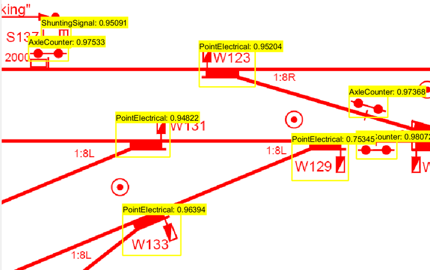

# RailSymbolDetect: Automated BOM Generation of Railways Schematics

## Project Overview

RailSymbolDetect is an advanced image processing and machine learning project designed to automate the creation of Bills of Material (BOM) from railway schematics. This tool significantly reduces the manual effort in identifying and cataloging electronic equipment and symbols used in railway routes, streamlining the documentation and planning process for railway construction.

## Key Technologies

- MATLAB
- YOLOX object detector
- Image Segmentation
- Data Augmentation
- Modified Non-Maximum Suppression (NMS)
- Color Detection

## Core Components

1. **Image Processing Pipeline**
   - PDF to Image Conversion
   - Image Segmentation
   - Symbol Detection and Classification
   - Color Identification
   - Data Export to Excel

2. **YOLOX Model Training**
   - Pre-trained Model Utilization
   - Data Augmentation
   - Performance Monitoring (Training and Validation Loss)
   - Model Evaluation (Average Precision Scores)

3. **Post-Processing**
   - Modified NMS for Duplicate Detection Handling
   - Color Identification Algorithm

## Key Achievements

- Successful automation of BOM generation from complex railway schematics
- Significant improvement in model performance through data augmentation
- High precision scores for symbol detection (0.95 to 1.0 for most classes)

## Challenges Addressed

1. **Data Scarcity**: Resolved through synthetic data augmentation techniques
2. **Symbol Variability**: Implemented robust detection algorithms
3. **Large Schematic Processing**: Solved with advanced image segmentation and reassembly

## Project Structure

- `PDFImageConverter.m`: PDF to image conversion
- `ImageSegmenter.m`: Image segmentation
- `SymbolDetector.m`: Symbol detection and identification
- `SymbolProcessor.m`: Symbol classification and processing
- `ExportToExcel.m`: Data export to Excel
- `Main.m`: Main execution script
- `YOLOXTrainingScript.m`: YOLOX model training
- `CreateAugmentedImageDataset.m`: Data augmentation

## Results Visualization

## Future Directions

1. Expand the model's training dataset to include a wider variety of symbols
2. Implement additional processing techniques for improved accuracy
3. Develop strategies to handle composite and non-standard symbols
4. Explore potential applications in other engineering domains

Author
Copyright (c) 2024 Igor Adamenko. All rights reserved. Afeka College of Engineering Electrical Engineering Department
