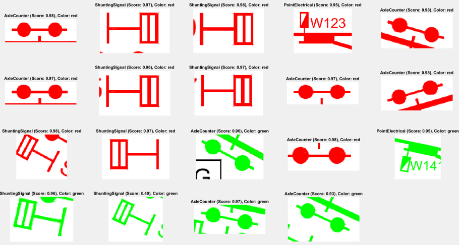
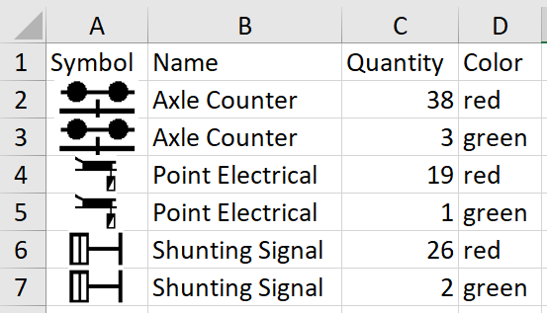

## Project Overview

A machine learning project designed to automate the creation of Bills of Material (BOM) from railway schematics. 

## Key Technologies

- MATLAB
- YOLOX object detector
- Image Segmentation
- Data Augmentation
- Modified Non-Maximum Suppression (NMS)
- Color Detection

## Core Components

1. **Image Processing Pipeline**
   - PDF to Image Conversion
   - Image Segmentation
   - Symbol Detection and Classification
   - Color Identification
   - Data Export to Excel

2. **YOLOX Model Training**
   - Data Augmentation
   - Performance Monitoring (Training and Validation Loss)
   - Model Evaluation (Average Precision Scores)

3. **Post-Processing**
   - Modified NMS for Duplicate Detection Handling
   - Color Identification Algorithm

## Key Achievements

- Addressed large schematic partitioning
- Addreseed data scarcity
- Improved performance through data augmentation
- High precision scores for symbol detection (0.95 to 0.98 for most classes)

## Project Structure

- `PDFImageConverter.m`: PDF to image conversion
- `ImageSegmenter.m`: Image segmentation
- `SymbolDetector.m`: Symbol detection and identification
- `SymbolProcessor.m`: Symbol classification and processing
- `ExportToExcel.m`: Data export to Excel
- `Main.m`: Main execution script
- `YOLOXTrainingScript.m`: YOLOX model training
- `CreateAugmentedImageDataset.m`: Data augmentation

## Results Visualization

